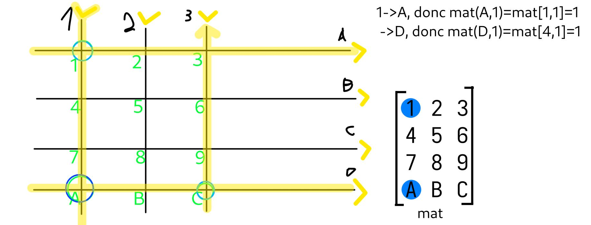
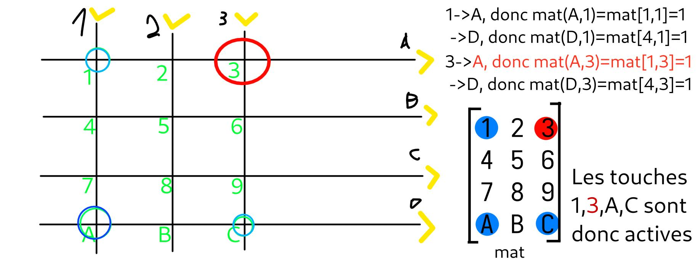

# Comment fonctionne l'algo de blocage pour empêcher les ghost keys
voici notre matrice de touches avec les colonnes 1 à 3 et nos lignes A à D permettant d'appuyer sur les touches 1 à C.
> [!NOTE]
> La matrice `mat` contient des booléens (réinitialisés à 0=false avant chaque frame)

> [!NOTE] Note n°2
> Ici la représentation suggère les colonnes envoient du courant séquentiellement. La représentation est plus compréhensible comme ça et cela fonctionne, mais ce n'est pas exactement ce qui est utilisé dans notre cas. Nous utilisons des colonnes en pull up qui passent en output open drain envoyant un 0 lorsqu'elles sont "actives" dans le scan, et repassent immédiatement après en input pull up.

## Scan sans problème
On décide d'appuyer sur 1 et C en premier

Le scan passe et tout va bien

Les touches détectées sont bonnes

## Le problème : apparition de ghost key

On décide maintenant d'ajouter A.

Le scan passe et révèle 4 touches pressées

La touche 3 est une ghost key

## La solution
La solution pour les claviers diodeless est donc d'ajouter un algorithme de blocage. Celui-ci se trouve entre le scan et l'envoi des touches au système d'exploitation.
